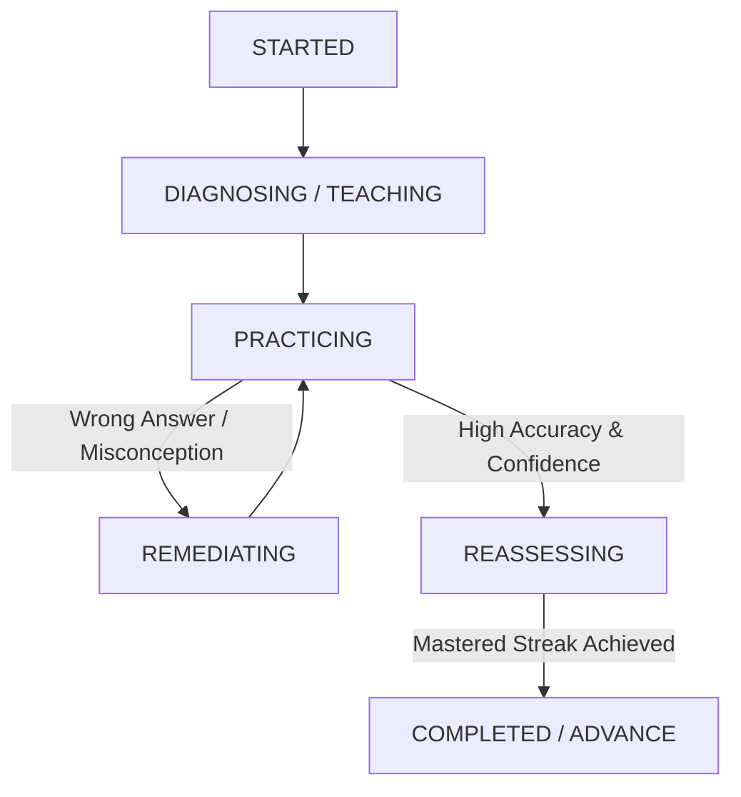

# Phase 5: Adaptive Learning Engine & Session Architecture

## Overview

Phase 5 introduces an **Evidence-Based Adaptive Learning Engine** for the **AI Remedial Learning Platform**.

> [!IMPORTANT]
> **Deterministic Engine Authority**: The deterministic **Mastery Engine**, **Learning Gap Engine**, and **LearningPlanService** remain the sole authorities for academic mastery state and progression. AI agents evaluate answers and detect potential misconceptions, but all state updates pass through deterministic validation services.

---

## 1. Adaptive Session State Machine

Adaptive learning sessions transition strictly through valid states:

- **`STARTED`**: Initialized session with difficulty level (1–5) mapped from current mastery.
- **`PRACTICING`**: Delivering level-matched practice questions.
- **`REMEDIATING`**: AI-assisted hints and targeted explanations following a detected misconception.
- **`REASSESSING`**: Mini reassessment verifying consistency before marking a concept mastered.
- **`COMPLETED`**: Advanced concept state in active learning plan.

---

## 2. Misconception Resolution Framework

1. **Detection**: AI Evaluator identifies conceptual errors (e.g. `FRACTION_DENOMINATOR_ERROR` when adding numerators/denominators directly).
2. **Logging**: `MisconceptionService` logs/increments `occurrenceCount` and marks `resolved = false`.
3. **Resolution Criteria**: A misconception is marked `resolved = true` ONLY after **3 consecutive successful correct answers** on that concept.

---

## 3. Spaced Review & Retention Schedule

To prevent arbitrary knowledge decay, time elapsed schedules review opportunities rather than artificially lowering mastery scores.

- **Spaced Intervals**: 1 day $\rightarrow$ 3 days $\rightarrow$ 7 days $\rightarrow$ 14 days $\rightarrow$ 30 days.
- **Failed Review**: Interval resets to 1 day and triggers `CONCEPT_REGRESSED` learning event.

---

## 4. API Reference

| Endpoint | Method | Description |
|---|---|---|
| `/api/adaptive/sessions` | POST | Start an adaptive learning session |
| `/api/adaptive/sessions/:id` | GET | Retrieve session status and turn history |
| `/api/adaptive/sessions/:id/respond` | POST | Submit answer turn and receive evaluation + next question |
| `/api/adaptive/sessions/:id/hint` | POST | Request guided hint |
| `/api/adaptive/sessions/:id/complete` | POST | Complete session |
| `/api/students/:studentId/learning-state` | GET | Aggregated student learning state |
| `/api/students/:studentId/mastery-history` | GET | Audit log of student mastery updates |
| `/api/students/:studentId/misconceptions` | GET | Active and resolved student misconceptions |
| `/api/students/:studentId/reviews` | GET | Due spaced retention reviews |
| `/api/students/:studentId/recommendations` | GET | Deterministic next action recommendation |
