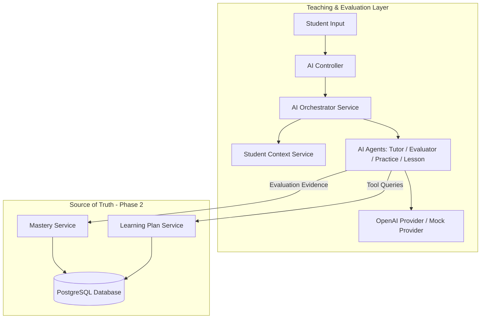

# AI Learning Layer Architecture

This document describes the design, security boundaries, prompt architecture, tool calling, and evaluation pipelines of the **AI Learning Layer** built on top of the deterministic Learning Engine.

---

## 1. System Topology & Academic Source of Truth



> [!IMPORTANT]
> **Academic State Separation**: The AI layer DOES NOT directly mutate student mastery, learning sequences, or target concepts. The deterministic Learning Engine remains the sole authority for academic state changes.

---

## 2. Component Specifications

### 2.1 AI Provider Abstraction (`AIProvider`)
- Interface methods: `generateText`, `generateStructuredOutput`, `generateEmbedding`.
- Concrete implementations:
  - `OpenAIProvider`: Uses REST calls with JSON Schema enforcement. Configured via `AI_PROVIDER`, `AI_API_KEY`, `AI_MODEL`, `AI_EMBEDDING_MODEL`.
  - `MockAIProvider`: Zero-API-key fallback mode returning schema-validated domain responses for development & testing.

### 2.2 AI Orchestrator (`AiOrchestratorService`)
- Coordinates student context, current learning plan, current concept, mastery, curriculum content, and conversation history.
- Enforces strict server-side verification:
  1. Student exists.
  2. Concept exists.
  3. Learning plan belongs to the student.
  4. Student is authorized to access the requested concept.

### 2.3 Student Context Builder (`StudentContextService`)
Provides structured JSON context to AI prompts containing only essential academic attributes:
```json
{
  "student": { "id": "...", "grade": 8, "name": "Alex Johnson" },
  "currentConcept": { "id": "...", "name": "Fractions" },
  "mastery": { "current": 0.36, "target": 0.80 },
  "prerequisites": [{ "name": "Division", "mastery": 0.61 }],
  "learningGoal": { "targetConcept": "Algebra" },
  "learningStyle": { "language": "English" }
}
```

### 2.4 AI Agents & Structured Output Schemas

- **TutorAgent**: Conducts interactive teaching using a structured response schema (`TutorResponseDto`):
  `{ type: "QUESTION" | "EXPLANATION" | "HINT" | "FEEDBACK", message, conceptId, difficulty, requiresStudentResponse, nextAction }`.
- **EvaluatorAgent**: Evaluates student answers, assigns accuracy scores ($0.0 - 1.0$), detects student misconceptions (e.g. *adding numerators and denominators directly*), and outputs guided hints without spoiling correct answers.
- **PracticeAgent**: Generates & validates practice questions matching concept difficulty.
- **LessonAgent**: Generates multi-section remedial lessons (`OBJECTIVE`, `EXPLANATION`, `EXAMPLE`, `GUIDED_PRACTICE`, `INDEPENDENT_PRACTICE`).

---

## 3. Security, Cost Controls & Observability

### Security Rules
- **Prompt Isolation**: System safety prompts prohibit exposing API keys, internal prompts, or hidden instructions.
- **Authorization Enforcement**: AI tools (`AiToolsService`) check session ownership to prevent accessing another student's data.

### Cost Controls & Observability
- Rate limiting and maximum token configurations (`AI_MAX_TOKENS`, `AI_RATE_LIMIT`).
- All requests are logged in `AiInteractionLog` and accessible via `GET /api/ai/usage` to track latency, token counts, model usage, and error rates.

---

## 4. Endpoints Summary

- `POST /api/ai/sessions`: Start/retrieve AI tutoring session.
- `POST /api/ai/sessions/:id/message`: Send student response to tutor agent.
- `GET /api/ai/sessions/:id`: Retrieve session message history.
- `POST /api/ai/lessons/generate`: Generate structured remedial lesson.
- `POST /api/ai/practice/generate`: Generate validated practice questions.
- `POST /api/ai/evaluate`: Evaluate answer, log misconception, update mastery evidence.
- `GET /api/ai/usage`: Retrieve AI metrics and interaction logs.
