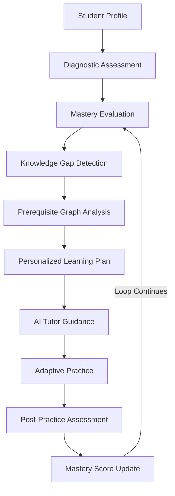

# AI Remedial Learning Platform - Architectural Overview

The **AI Remedial Learning Platform** is engineered specifically for students who are academically behind their current class grade level. Instead of standard linear learning paths, the platform dynamically identifies historical prerequisite gaps and builds targeted remedial learning pathways.

---

## Core Learning Loop Architecture

---

## Detailed Pipeline Stages

### 1. Student Onboarding & Baseline Profile
- Tracks student's current grade level vs. target grade level.
- Establishes initial user, teacher, and subject associations.

### 2. Diagnostic Assessment
- Adaptive question delivery across domain concepts.
- Evaluates proficiency baseline across subjects (e.g. Mathematics).

### 3. Mastery Level Evaluation
- Computes baseline concept mastery scores (0% to 100%).
- Assigns mastery levels (Level 0: Unattempted, Level 1: Deficient, Level 2: Developing, Level 3: Mastered).

### 4. Knowledge Gap Detection & Prerequisite Graph Analysis
- Uses the `ConceptPrerequisite` graph database structure (`Concept A → Concept B → Concept C`).
- If a student fails a target concept (e.g., *Fractions*), the engine recursively walks back prerequisite nodes to locate the root historical gap (e.g., *Division* or *Addition*).

### 5. Personalized Learning Plan Generation
- Assembles a sequence of `LearningPlanItem` steps targeting only the identified prerequisite gaps first before unlocking advanced topics.

### 6. AI Tutor Guidance (Phase 2 Abstraction)
- Agnostic `AIProvider` service interface (`generateText`, `generateStructuredOutput`, `generateEmbedding`).
- RAG architecture querying concept document chunks to provide context-aware, patient micro-tutoring.

### 7. Adaptive Practice & Ongoing Assessment
- Interactive exercise delivery per remedial learning plan item.
- Measures response accuracy, speed, and hint reliance.

### 8. Mastery Update & Graph Progression
- Updates `Mastery` record upon passing post-practice checks.
- Unlocks subsequent dependent concept nodes in the prerequisite graph until the student catches up to their grade level.
