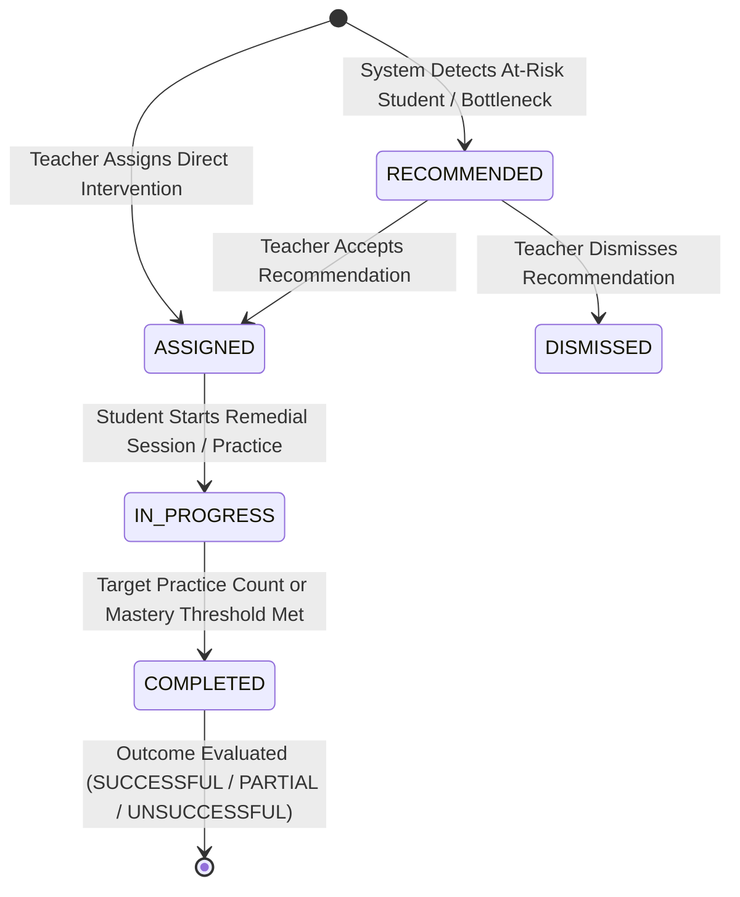

# Teacher Intervention Model & Lifecycle

## Overview
The Intervention System provides structured tracking, assignment, and objective outcome evaluation for teacher-led and system-recommended student remediations in the **AI Remedial Learning Platform**.

---

## Intervention Lifecycle State Machine

---

## Objective Outcome Measurement

Intervention effectiveness is evaluated objectively using pre- and post-intervention concept mastery levels:

$$\Delta \text{Mastery} = \text{afterMastery} - \text{beforeMastery}$$

### Outcome Classification
| Outcome | Condition | Description |
| :--- | :--- | :--- |
| **`SUCCESSFUL`** | $\Delta \text{Mastery} \ge +0.20$ or $\text{afterMastery} \ge 0.80$ | Concept successfully mastered by student. |
| **`PARTIALLY_SUCCESSFUL`** | $+0.05 \le \Delta \text{Mastery} < +0.20$ | Partial improvement demonstrated; further practice recommended. |
| **`UNSUCCESSFUL`** | $\Delta \text{Mastery} < +0.05$ | Minimal or zero mastery gain achieved post-intervention. |
| **`INCONCLUSIVE`** | Insufficient post-intervention assessment data | Outcome awaiting further practice attempts. |

---

## Privacy & Access Control Guidelines
1. **Teacher Isolation**: Teachers can only view or create interventions for students enrolled in their assigned class groups.
2. **Notes Security**: `teacherNotes` are private to teaching staff and are excluded from student-facing API endpoints and AI prompt contexts.
