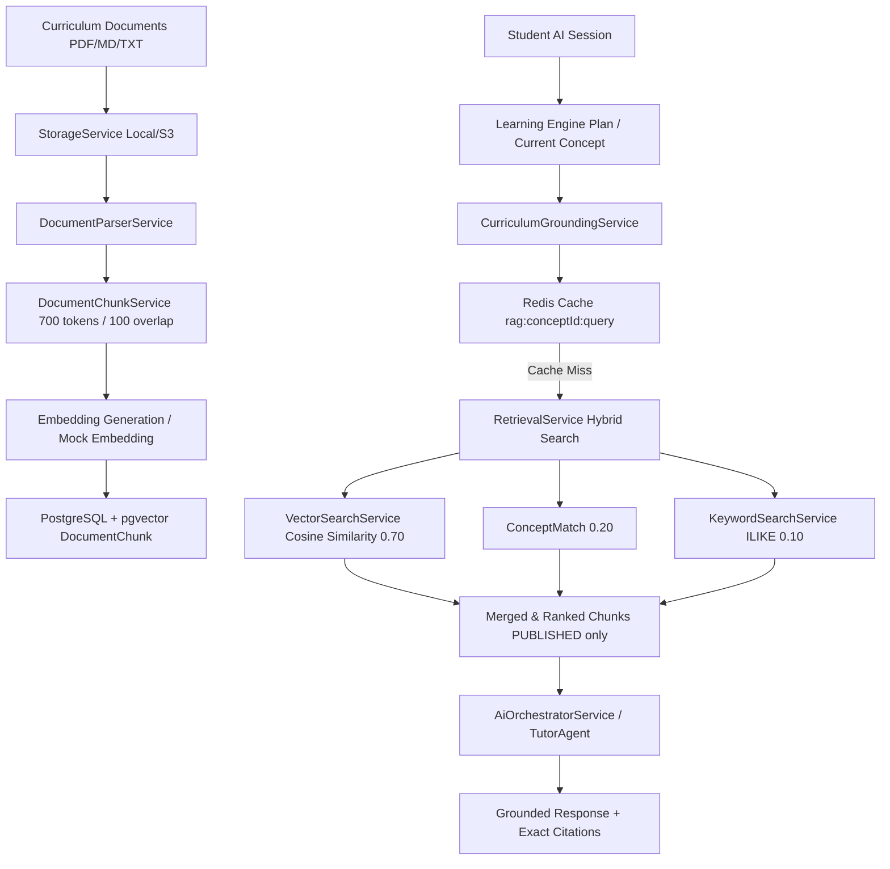

# Curriculum RAG, Ingestion & Grounded AI Teaching Architecture

## Executive Overview

Phase 4 introduces a production-ready Retrieval-Augmented Generation (RAG) pipeline into the **AI Remedial Learning Platform**.

> [!IMPORTANT]
> **Core Architectural Principle**: The deterministic Learning Engine remains the **SOLE SOURCE OF TRUTH** for student mastery, learning gaps, root prerequisite gaps, learning plans, concept sequence, and mastery thresholds. RAG provides **trusted curriculum knowledge and context**, while the LLM decides **how to adapt and explain** the retrieved knowledge.

---

## Architecture Diagram



---

## 1. Document Ingestion Pipeline

### Document Processing Workflow
1. **Upload**: Document is submitted via `POST /api/rag/documents` (base64 or multipart) and written to `StorageService` (`storage/documents/{id}/original.{ext}`).
2. **Parsing**: `DocumentParserService` routes file by MIME type to format-specific parsers (`TextDocumentParser`, `MarkdownDocumentParser`, `PdfDocumentParser`).
3. **Semantic Chunking**: `DocumentChunkService` breaks extracted text into chunks of ~700 tokens with a 100-token overlap, preserving heading boundaries and paragraph structure.
4. **Embedding Generation**: Vector embeddings (1536-dim or fallback normalized embeddings) are generated for each chunk.
5. **Database Storage**: Chunks and embeddings are saved to PostgreSQL `DocumentChunk` table with vector indexing.
6. **Concept Association**: Automated keyword/code matching links chunks to existing `Concept` entities with `SUGGESTED` status.

### Supported File Formats
- **Plain Text (`.txt`)**: Extracted directly using UTF-8 encoding.
- **Markdown (`.md`)**: Preserves section titles (`#`, `##`, `###`) for section metadata.
- **PDF (`.pdf`)**: Extracted using `pdf-parse` with fallback text normalization.

---

## 2. Hybrid Retrieval Engine

Retrieval computes a weighted hybrid score combining three distinct scoring components:

$$\text{Final Score} = 0.70 \times S_{\text{semantic}} + 0.20 \times S_{\text{concept}} + 0.10 \times S_{\text{keyword}}$$

1. **Semantic Search ($0.70$)**: Cosine similarity computed in PostgreSQL via `pgvector` (`1 - (embedding <=> query_vector)`).
2. **Concept Match ($0.20$)**: Direct alignment score when a chunk is explicitly linked via `CurriculumContent` to the active target concept.
3. **Keyword Match ($0.10$)**: SQL `ILIKE` pattern match score for query terms in chunk text.

---

## 3. Publication & Security Model

> [!CAUTION]
> **Strict Access Isolation**: Students can **ONLY** retrieve content from documents with `visibility = PUBLISHED` and `status = PROCESSED`. Draft or processing documents are never exposed in AI sessions.

- `DocumentVisibility.DRAFT`: Only visible to Admins/Teachers.
- `DocumentVisibility.PUBLISHED`: Available to the `RetrievalService` for student grounding.
- `DocumentVisibility.ARCHIVED`: Excluded from active searches.

---

## 4. AI Grounding & Citation Framework

When the student asks a question or works through a learning plan step:
1. `AiOrchestratorService` retrieves top relevant chunks for the current concept.
2. Grounding context is injected into `TutorAgent` system prompt (`RAG_TUTOR_SAFETY_PROMPT`).
3. The prompt strictly instructs the LLM to base explanations on retrieved sources and cite every claim.
4. Output includes formatted citations:
   ```json
   {
     "documentTitle": "Grade 8 Mathematics Curriculum Guide",
     "pageNumber": 3,
     "sectionTitle": "Section 1.3: Division and Inverse Multiplication",
     "snippet": "Division is the inverse operation of multiplication..."
   }
   ```

---

## 5. Caching & Performance Optimization

- **Redis Query Cache**: Frequent grounding queries are cached under `rag:{conceptId}:{hash(query)}` with a 1-hour TTL.
- **Async Job Queue**: Large document ingestion jobs run asynchronously via BullMQ (`document-processing` queue).
- **Database Indexing**: HNSW vector index on `DocumentChunk.embedding` for sub-10ms similarity queries.

---

## 6. REST API Reference

| Endpoint | Method | Description | Access |
|---|---|---|---|
| `/api/rag/documents` | POST | Upload and process curriculum document | Admin/Teacher |
| `/api/rag/documents` | GET | List curriculum documents | Admin/Teacher |
| `/api/rag/documents/:id` | GET | Get document details and chunks | Admin/Teacher |
| `/api/rag/documents/:id/publish` | PATCH | Publish document for AI grounding | Admin/Teacher |
| `/api/rag/documents/:id/reprocess` | POST | Reprocess text, chunking & embeddings | Admin/Teacher |
| `/api/rag/documents/:id` | DELETE | Delete document and chunks | Admin/Teacher |
| `/api/rag/search` | POST | Execute hybrid search over chunks | All |
| `/api/rag/concepts/:conceptId/associate` | POST | Associate chunk with concept | Admin/Teacher |
