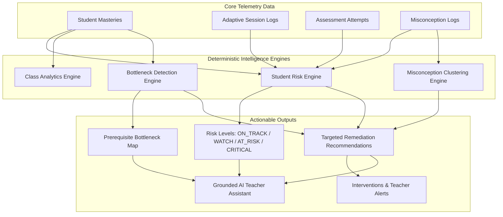

# Teacher Intelligence Architecture

## Overview
The Teacher Intelligence system in the **AI Remedial Learning Platform** converts raw telemetry from diagnostic assessments, mastery updates, adaptive sessions, and misconception logs into actionable pedagogical insights for teachers.

---

## Core Pillars & System Design

---

## Deterministic Risk Scoring Formula

Student risk is calculated deterministically on a normalized $0 - 100$ scale:

$$\text{RiskScore} = 0.25 S_{\text{lowMastery}} + 0.20 S_{\text{prereqGap}} + 0.15 S_{\text{recentPerf}} + 0.15 S_{\text{misconception}} + 0.10 S_{\text{stagnation}} + 0.10 S_{\text{regression}} + 0.05 S_{\text{inactivity}}$$

### Risk Thresholds & Classification
- **`ON_TRACK`** (Score: $0 - 24$): Student is progressing normally on target concepts.
- **`WATCH`** (Score: $25 - 49$): Early warning indicators present; monitor weekly.
- **`AT_RISK`** (Score: $50 - 74$): Substantial mastery gaps; requires targeted remediation (at least 3 evidence points required).
- **`CRITICAL`** (Score: $75 - 100$): Severe prerequisite breakdown; requires immediate 1-on-1 teacher intervention.

---

## Prerequisite Bottleneck Detection
The Bottleneck Analytics Engine identifies foundational concepts that cause downstream failure across multiple students.
- **Impact Score Calculation**:
  $$\text{ImpactScore} = \text{AffectedStudentCount} \times (\text{BlockedDownstreamConceptCount} + 1) \times 10$$
- Allows teachers to prioritize whole-class review for high-impact bottlenecks rather than treating isolated symptoms.

---

## Grounded AI Teacher Assistant
The AI Teacher Assistant operates on top of deterministic telemetry:
- Provides context-grounded summaries for parent notes, lesson plans, and teaching strategies.
- Strictly prohibited from independently modifying student risk scores, mastery states, or target learning sequences.
